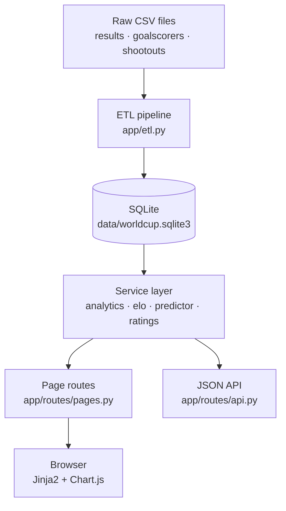
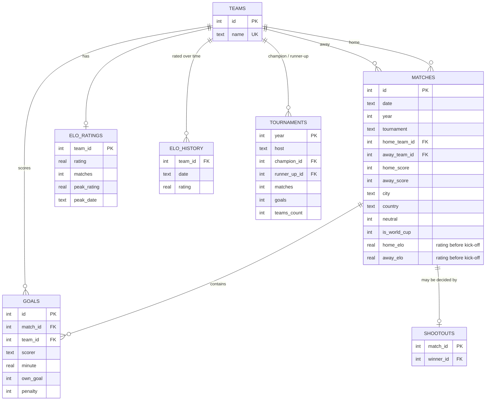
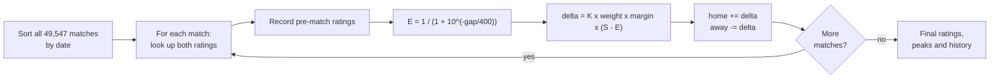
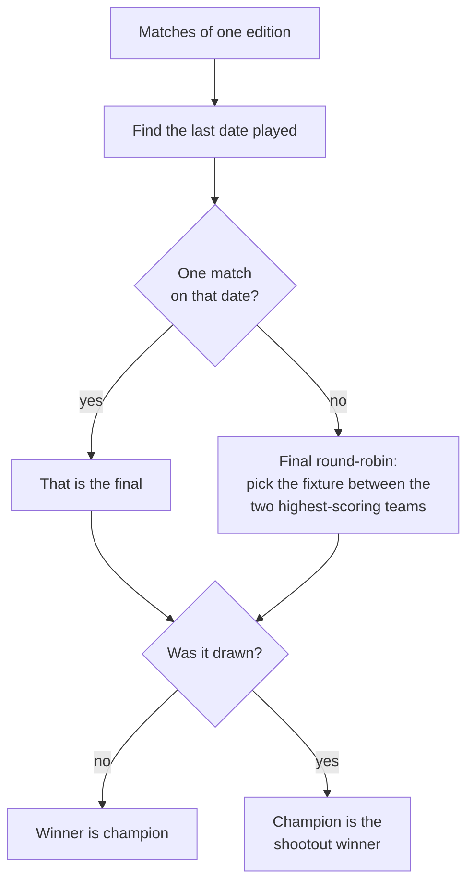
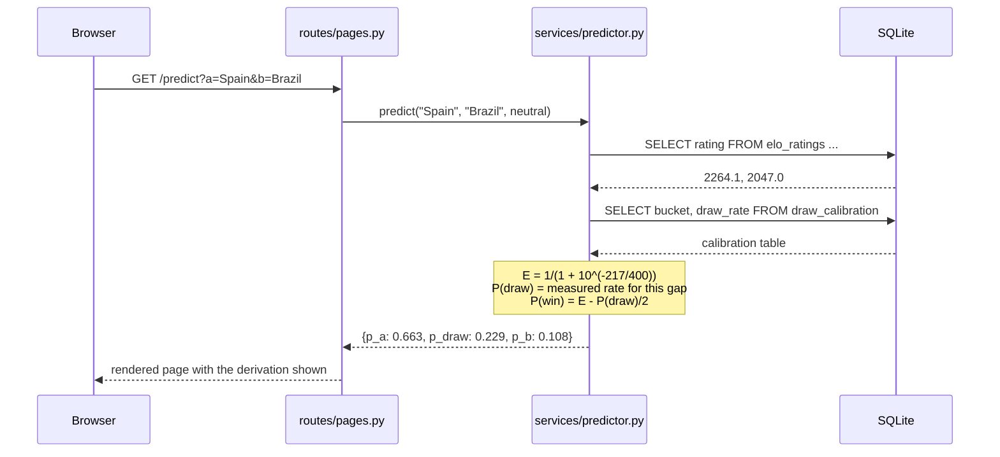
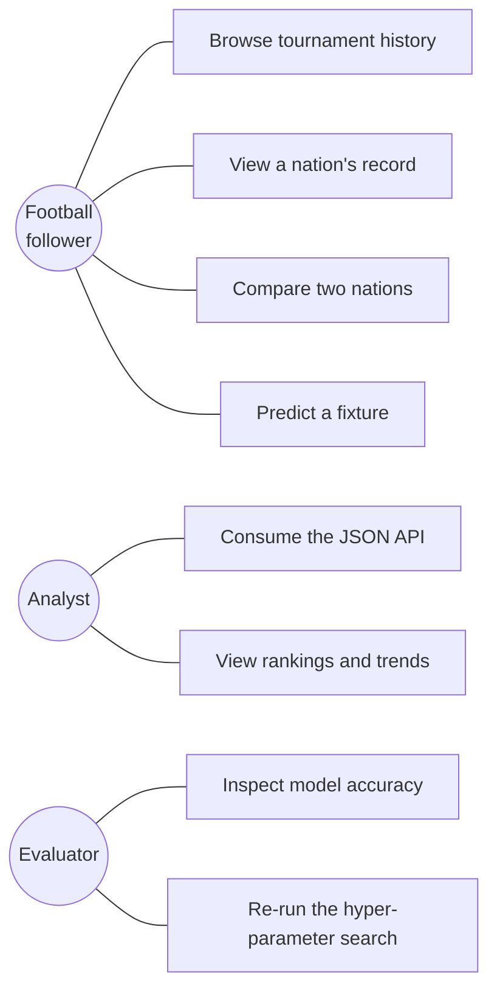

# Design Document

**Project:** World Cup Analytics

---

## 1. Architectural overview

The system is a **layered (n-tier) architecture** with a strict dependency direction:
each layer knows only about the one below it.



### Why this shape

The expensive work — replaying 49,547 matches, calibrating the draw model, scoring it —
happens **once, offline, in the ETL pipeline**. The web tier only ever reads pre-computed
results, so pages render in milliseconds.

The rule that makes the system testable: **routes contain no SQL, services contain no
HTTP, and the rating engine touches neither.** `elo.py` and the probability functions in
`predictor.py` are pure functions over numbers, so the most important logic in the project
can be tested without starting a database or a web server.

---

## 2. Component design

| Component | Responsibility | Depends on |
|---|---|---|
| `config.py` | Every tunable constant in one place | — |
| `db.py` | Connection handling and query execution | Flask context |
| `etl.py` | Extract, clean, derive, calibrate, evaluate, load | pandas, elo, predictor |
| `services/elo.py` | Rating mathematics and the replay engine | config only |
| `services/predictor.py` | Ratings → probabilities; model metrics | config, db |
| `services/analytics.py` | Analytical SQL queries | db |
| `services/ratings.py` | Queries over the rating tables | db |
| `routes/pages.py` | Gather data, render templates | services |
| `routes/api.py` | Gather data, serialise JSON | services |

---

## 3. Data model



Two supporting tables hold the model itself: `draw_calibration` (observed draw rate per
rating-gap bucket) and `model_metrics` (measured accuracy and Brier scores).

### The `team_matches` view

A match is naturally stored once, with a home side and an away side. But almost every
analytical question is asked from *one team's* point of view. The view writes each match
twice, once per side:

```sql
CREATE VIEW team_matches AS
    SELECT id, ..., home_team_id AS team_id, away_team_id AS opponent_id,
           home_score AS gf, away_score AS ga FROM matches
    UNION ALL
    SELECT id, ..., away_team_id, home_team_id, away_score, home_score FROM matches;
```

Every "how did team X do?" query then collapses to `WHERE team_id = ?`, which is why
`team_record` is one short SQL statement rather than a page of Python.

---

## 4. Key algorithms

### 4.1 Elo replay



Recording the pre-match ratings at step 3 is what makes honest evaluation possible later:
every prediction is scored using only information that existed before kick-off.

### 4.2 Deriving the champion of an edition



The round-robin branch exists because of 1950, which had no final: Uruguay won the
tournament in a four-team group whose last two matches were played on the same day.
Taking "the last match played" alone would have crowned Sweden.

### 4.3 Prediction sequence



---

## 5. Use cases



---

## 6. Design decisions

| Decision | Alternative considered | Why |
|---|---|---|
| **SQLite** | PostgreSQL | Zero setup, single file, ships with Python. The dataset is 13 MB — a server would add operational cost for no benefit. |
| **Plain SQL, no ORM** | SQLAlchemy | The queries *are* the analysis. Hiding them behind an ORM would obscure the most interesting part of the code and add a dependency. |
| **Pre-compute in ETL** | Compute per request | Replaying 49,547 matches takes ~2 s. Doing it per request would make every page slow; doing it once makes every page instant. |
| **Server-rendered Jinja** | React SPA | No build step, no bundler, no node_modules. The pages are documents, not an application. |
| **Chart.js from CDN** | D3, or hand-rolled SVG | D3 is far more power than bar and line charts need; Chart.js is one script tag. |
| **Calibrated draw model** | Fixed 25% draw rate | The data shows draw rate varies from ~28% to ~12% with the rating gap. A fixed value would be measurably worse. |
| **Grid-searched constants** | Hand-picked values | The first hand-picked K produced a 300-point Spain/Brazil gap and overconfident forecasts. The search found settings with a better Brier score *and* more believable ratings. |
| **Margin cap** | Uncapped `sqrt(gd)` | A 9–0 says little more about strength than a 5–0, but uncapped it would swing a rating violently. |

---

## 7. Error handling

| Situation | Response |
|---|---|
| Unknown team in a URL | 404 page / `{"error": ...}` with HTTP 404 |
| Missing API query parameters | HTTP 400 with an explanatory message |
| Two teams that never met | Empty-state message, not an error |
| Same team selected twice | Prompt to pick two different teams |
| Rating gap outside the calibration table | Falls back to the nearest bucket |
| Probabilities that would go negative | Clamped at zero and renormalised |
| Database not yet built | Tests skip with a clear message; the app fails loudly at startup |

---

## 8. Known limitations

1. **Team identity over time.** West Germany and Germany are recorded as the source records
   them; the system does not merge historical identities.
2. **No knockout/group stage flag.** The source data does not label match stages, so
   analyses that would need it (for example "goals per match in knockout rounds") are absent.
3. **Elo ignores everything except results.** No squad strength, injuries, rest days or
   home crowd size — which is precisely why 60% accuracy, not 90%, is the realistic ceiling.
4. **Draw calibration is global.** One calibration table is used for all eras, although
   draw rates have drifted over 150 years.
5. **Ratings are not era-adjusted.** A 2000-rated team today is not directly comparable to a
   2000-rated team in 1950.
