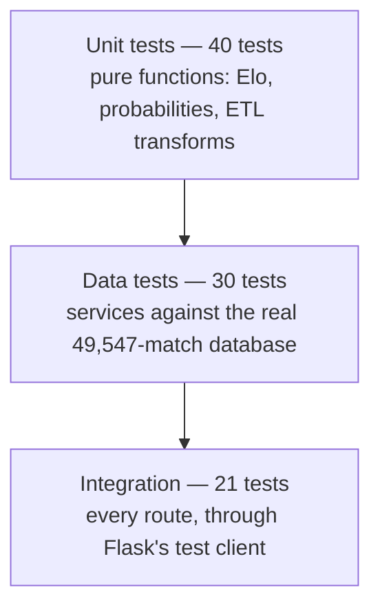

# Testing Strategy

**91 tests · all passing · run with `python -m pytest -q`**

---

## 1. Approach

The test suite is shaped by one design decision: **the important logic is pure.** The Elo
mathematics and the probability calculations take numbers and return numbers, with no
database, no HTTP and no global state. That means the parts most likely to be wrong are
also the cheapest to test exhaustively.

The suite is a standard pyramid:



| Level | File | Count | What it proves |
|---|---|---|---|
| Unit | `test_elo.py` | 21 | The rating mathematics is correct |
| Unit | `test_predictor.py` | 15 | Probabilities are valid and behave sensibly |
| Unit | `test_etl.py` | 10 | Transforms clean and derive data correctly |
| Data | `test_analytics.py` | 24 | Queries agree with the historical record |
| Integration | `test_api.py` | 21 | Every route works end to end |

---

## 2. What is actually tested

### 2.1 Mathematical properties, not just examples

Rather than asserting hard-coded outputs, the Elo tests assert the properties the model is
*supposed* to have — the kind of bug that a single example would miss:

| Property | Test |
|---|---|
| Equal ratings give an even contest | `test_equal_ratings_are_a_coin_flip` |
| A 400-point gap means 10:1 odds — the defining property of Elo | `test_four_hundred_point_gap_is_ten_to_one` |
| Both sides' expectations sum to 1 | `test_expectations_of_both_sides_sum_to_one` |
| Rating changes are zero-sum | `test_ratings_are_zero_sum` |
| Beating a stronger team is worth more | `test_beating_a_stronger_team_is_worth_more` |
| A draw transfers points to the underdog | `test_a_draw_transfers_points_to_the_underdog` |
| World Cup results move ratings more than friendlies | `test_world_cup_moves_ratings_more_than_a_friendly` |
| Big-win multiplier is capped | `test_factor_is_capped` |
| Pre-match ratings are captured *before* the update | `test_pre_match_ratings_are_recorded_before_the_update` |

The last one matters more than it looks: if the pre-match ratings were recorded after the
update, every reported accuracy figure would be inflated by hindsight. The test pins that
ordering in place.

### 2.2 Probabilities always form a distribution

The natural failure mode of the prediction formula is a **negative probability**: for a
very large rating gap, `E - P(draw)/2` can exceed 1, pushing `P(loss)` below zero.
`test_extreme_mismatch_stays_a_valid_distribution` drives a 1400-point gap through the
model and asserts the output is still valid, which is what the clamp-and-renormalise step
exists for.

Symmetry is also pinned: swapping the two teams must mirror the result exactly
(`test_swapping_the_teams_mirrors_the_result`).

### 2.3 Results checked against history

The analytics tests assert against facts that can be independently verified:

```python
assert champions[1930] == "Uruguay"
assert champions[1950] == "Uruguay"     # decided by a final round-robin
assert champions[2022] == "Argentina"   # decided on penalties
assert len(titles) == 5                 # Brazil
assert "Miroslav Klose" in names        # all-time World Cup scorer
```

The 1950 assertion is a **regression test for a real bug**: the first implementation took
"the last match played" as the final and crowned Sweden, because 1950 ended in a
round-robin whose last two matches were on the same day. The tie-break was added and this
test now prevents it coming back.

### 2.4 Internal consistency

Some tests check that the data cannot contradict itself, regardless of what the values are:

- Wins + draws + losses equals matches played, for every nation.
- Per-edition totals sum to the overall record.
- Head-to-head results are symmetric when the teams are swapped.
- A nation's peak rating is never below its current rating.
- World Cup matches are a strict subset of all international matches.
- Rankings are sorted and consecutively numbered.

These catch silent data corruption in a way that fixed expected values would not.

### 2.5 The API contract

Every route is exercised. Beyond the happy path:

| Case | Expected |
|---|---|
| `/teams/Nowhereland` | 404 with a rendered page, not a stack trace |
| `/api/teams/Nowhereland` | 404 with a JSON `error` field |
| `/api/predict?a=France` (missing `b`) | 400, not a 500 |
| `/api/head-to-head` with no parameters | 400 |

---

## 3. Test design techniques

| Technique | Where it is used |
|---|---|
| **Equivalence partitioning** | Match outcomes partitioned into win / draw / loss (`test_result_encoding`) |
| **Boundary value analysis** | Bucket edges at 0, 49, 50 — where off-by-one errors live (`test_gap_maps_to_bucket`) |
| **Property-based reasoning** | Symmetry, zero-sum and summing-to-one asserted as invariants |
| **Regression testing** | The 1950 champion, pinning a fixed bug |
| **Negative testing** | Unknown teams, missing parameters, teams that never met |
| **Parameterised testing** | `@pytest.mark.parametrize` over all pages and all result types |
| **Fixtures** | Shared app, client and context fixtures; a hand-built 1950 fixture for the ETL |

---

## 4. Running the tests

```bash
python -m pytest -q                    # everything
python -m pytest tests/test_elo.py -v  # one file, verbose
python -m pytest -k "draw"             # anything about draws
```

If the database has not been built yet, the data and integration tests **skip with an
explanatory message** rather than failing. On a fresh checkout `python -m pytest -q`
reports **40 passed, 51 skipped** — the 40 being the pure unit tests, so the core logic is
verifiable before any ETL run. After `python -m app.etl` the full 91 run.

---

## 5. Results

```
91 passed in 2.22s
```

| Area | Tests |
|---|---|
| Rating engine | 21 |
| Prediction model | 15 |
| ETL transforms | 10 |
| Analytics queries | 24 |
| Routes and API | 21 |

---

## 6. Beyond the unit tests: evaluating the model

Unit tests prove the code does what it was written to do. They cannot prove the *model* is
any good — that requires a separate, statistical form of verification, run as part of the
ETL:

1. The draw model is calibrated using **only matches before 2015**.
2. It is then scored on the **11,130 matches played since**, which had no influence on it.
3. Each prediction uses only the ratings that existed before that match — a walk-forward
   evaluation, not a peek at the answer.

| Metric | Result | Interpretation |
|---|---|---|
| Accuracy | **60.1%** | vs 47.7% for always picking the home team |
| Brier score | **0.516** | vs 0.667 for uninformed guessing |
| Test matches | 11,130 | Large enough that the result is not noise |

Both numbers are displayed in the application itself, so the model's limits are visible to
anyone using it rather than buried in a document.

---

## 7. Not covered

- **Browser testing.** The templates and charts were verified by hand across pages and
  screen widths, not by an automated browser suite.
- **Load testing.** The system is single-user by design.
- **Property-based fuzzing.** A library such as Hypothesis would strengthen the invariant
  tests in §2.1; the current tests assert those properties at hand-chosen points.
